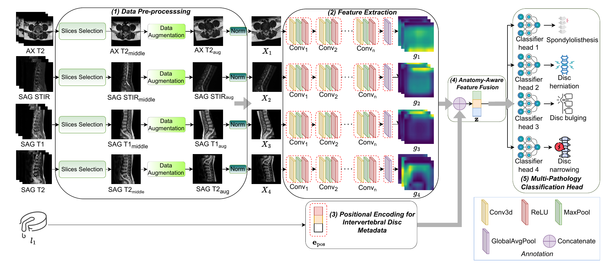

# MRI Phenotyping - Multi-Label Pathology Classification


A deep learning project for automated detection of spinal pathology from MRI DICOM images using the PhenikaaMed dataset. This project implements multi-label classification to detect four types of spinal pathology: disc herniation, disc bulging, spondylolisthesis, and disc narrowing.

## Project Overview



This project provides a complete pipeline for:
- **Multi-label pathology classification** from lumbar spine MRI images
- **Multi-sequence fusion**: All models automatically fuse information from multiple MRI sequences (SAG_T2, AX_T2, SAG_STIR)
- **Support for multiple architectures**: ResNet, EfficientNet, DenseNet, and Vision Transformer (ViT) - all with multi-sequence support
- **Comprehensive evaluation** with automatic model comparison
- **Experiment tracking** with Weights & Biases (wandb)
- **Threshold optimization** for improved precision-recall balance

Predict 4 independent binary pathology labels:
1. **Disc herniation** - Herniated disc material
2. **Disc bulging** - Disc bulging beyond normal boundaries
3. **Spondylolisthesis** - Vertebral slippage
4. **Disc narrowing** - Disc space narrowing

---


---

## Installation

### Prerequisites

- Python 3.8 or 3.10 (3.10 recommended)
- CUDA-capable GPU (recommended for training)
- [uv](https://astral.sh/uv/) package manager (fast package and environment manager)
- Docker & Docker Compose (for API Serving)

### Setup Environment

This project utilizes `uv` with `pyproject.toml` and `uv.lock` for exact, blazingly fast dependency resolution.

```bash
# Sync dependencies and automatically create the virtual environment
uv sync

# Activate the environment
source .venv/bin/activate
```

Verify CUDA installation:
```bash
python -c "import torch; print('CUDA available:', torch.cuda.is_available()); print('CUDA version:', torch.version.cuda)"
```

---

## Quick Start 

### 1. Training
Train the optimal model architecture (EfficientNet-B1) on the pathology dataset:

```bash
uv run python scripts/train_pathology_model.py --backbone efficientnet_b1
```
*Model checkpoints and optimal thresholds will be saved to `outputs/pathology_model/runs/`.*

### 2. Testing / Evaluation
Evaluate a trained model using the validation/test sets to generate the performance metrics:

```bash
uv run python scripts/evaluate_pathology_model.py --backbone efficientnet_b1
```
*(Tip: Add the `--all` flag instead to evaluate and compare across all trained architectures).*

### 3. API Model Serving (Web UI & Docker)
To run the natively containerized Patient Diagnosis Web UI and API Endpoints:

```bash
# Build and run background Docker containers natively
sudo docker compose build
sudo docker compose up -d
```
The FastAPI instance will boot automatically. Open your browser to access the Clinical Portal at:
**📍 Web UI:** [http://localhost:8000](http://localhost:8000)

*(To check Swagger internal API Docs: [http://localhost:8000/docs](http://localhost:8000/docs))*

---

## Model Architectures

### Supported Architectures

1. **ResNet** (Baseline)
   - Variants: ResNet-18, ResNet-34, ResNet-50
   - Good for medical imaging, proven architecture
   - Fast training and inference

2. **EfficientNet** (Best Performance)
   - Variants: EfficientNet-B0, EfficientNet-B1, EfficientNet-B2
   - Compound scaling for efficiency
   - EfficientNet-B1 is the currently best performing architecture

3. **DenseNet** (High Accuracy)
   - Variants: DenseNet-121, DenseNet-169, DenseNet-201
   - Dense connections promote feature reuse
   - High overall accuracy but lower F1 compared to EfficientNet

4. **Vision Transformer (ViT)** (Advanced)
   - Variants: ViT-Base, ViT-Large
   - Self-attention mechanism for global context
   - State-of-the-art architecture

### Choosing an Architecture

- **For speed**: Use ResNet-18 or EfficientNet-B0
- **For best performance**: Use EfficientNet-B1 (current best)
- **For experimentation**: Try ViT-Base for attention-based features
- **For production**: EfficientNet-B1 with SAG-T2 sequences offers the best balance of diagnostic precision and computational efficiency

---

## Current Results

### Best Model Performance

**Best Overall Model: EfficientNet-B1 (SAG-T2 + Positional Encoding)**
- **Macro F1 Score**: 50.31%
- **Accuracy**: 57.78%
- **Macro ROC-AUC**: 87.46%
- **Macro Precision**: 60.01%
- **Macro Recall**: 59.87%

### Model Comparison (SAG-T2 with Positional Encoding)

| Architecture | Accuracy | Recall | Precision | F1-Score | ROC-AUC |
|--------------|----------|--------|-----------|----------|---------|
| **EfficientNet-B1** | 57.78 | 59.87 | **60.01** | **50.31** | 87.46 |
| EfficientNet-B0 | 56.11 | 63.95 | 40.54 | 49.62 | **88.47** |
| DenseNet | **66.67** | 54.93 | 48.60 | 48.60 | 88.41 |
| ResNet | 58.89 | 59.98 | 44.40 | 49.33 | 87.43 |
| EfficientNet-B2 | 53.33 | 66.86 | 32.22 | 43.48 | 84.34 |

### Key Findings

1. **EfficientNet-B1 performs best** overall, successfully mitigating overfitting while capturing pathological features effectively.
2. **Positional Encoding is Critical**: Using Positional Encoding for Intervertebral Disc (IVD) metadata maps levels into a continuous vector space, improving F1-score substantially compared to standard label encoding.
3. **Single Sequence Dominance**: Multi-sequence fusion strategies did not yield better diagnostic precision than solely utilizing the dense, information-rich SAG-T2 sequence. 

### Recommendations

1. **Use EfficientNet-B1 with SAG-T2 and Positional Encoding** as the targeted diagnostic setup.
2. **Focus on Positional Alignment** instead of default label encoding for modeling structural dependencies.
3. **Optimize compute resources**: Single-sequence processing for SAG-T2 is sufficient and highly prioritized for diagnostic precision.
